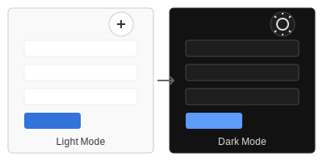

## LitLLMs, LLMs for Literature Review: Are we there yet?
[[Paper]](https://arxiv.org/abs/2412.15249) [[Website]](https://litllm.github.io)

LitLLM is a LLM for Literature Review. It is a web application that allows you to search for papers and articles, and write a literature for a your abstract or research idea. 

### Features

- Keyword and embedding-based search for relevant papers
- LLM-powered re-ranking for improved relevance
- Literature review generation based on retrieved papers
- Sentence plan control for customized literature reviews
- **Dark mode support** for comfortable reading in low-light environments

### Usage

Visit the website and toggle between light and dark mode using the button in the top-right corner. The site will remember your preference for future visits and can also automatically adapt to your system's color scheme preference.

